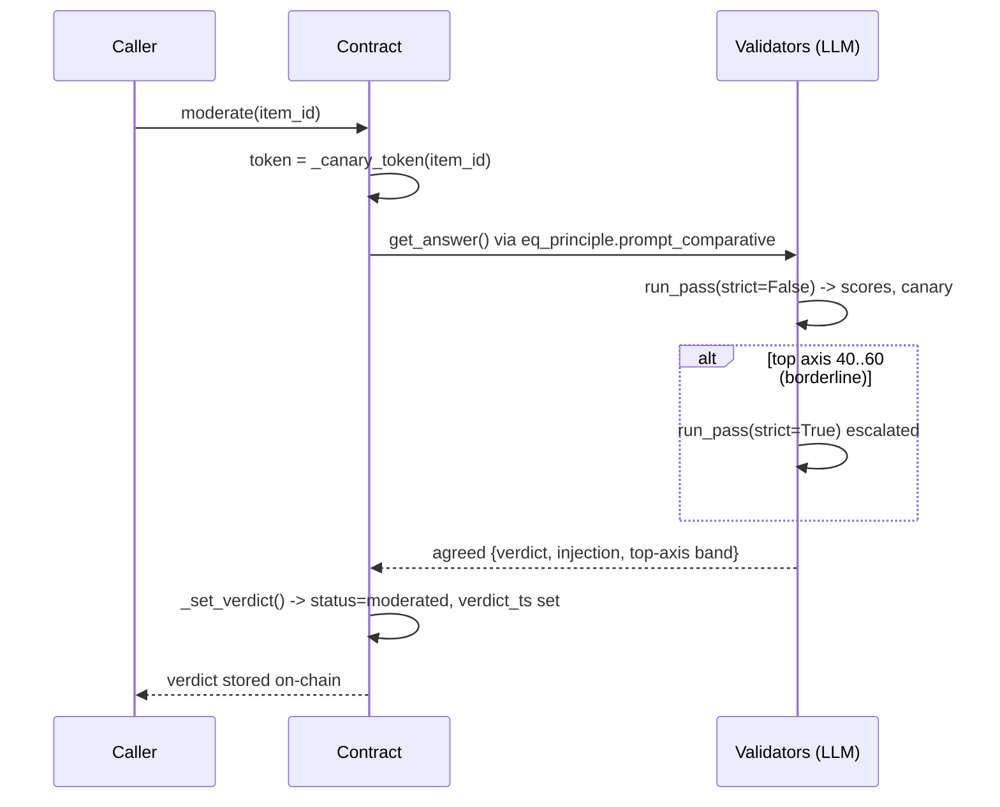

# Architecture — ContentModerator Registry (v1.2)

An on-chain, multi-item content-moderation registry where every
consensus-critical decision (content extraction, policy verdict, source
re-verification) is made inside the Intelligent Contract via the GenLayer
Equivalence Principle. Source: `contracts/registry.py`. v1.1 is deployed on
Bradbury at `0x20f6e32560427094aC913Da6e900c0b4899AE41A`; v1.2 supersedes it
(deployment address recorded in CHANGELOG.md / README on deploy).

## Item lifecycle (state machine)

```mermaid
stateDiagram-v2
    [*] --> created: create_item()
    created --> ingested: ingest() + author stake (URL dedup)
    ingested --> moderated: moderate() (AI verdict)
    moderated --> moderated: moderate() re-run [owner or active report; LLM cooldown]
    moderated --> enforced: enforce() [owner, or anyone after ENFORCE_TIMEOUT] + settle stakes
    enforced --> appealed: appeal() [author] + appeal bond
    appealed --> resolved: resolve_appeal() upheld -> overturned (terminal)
    appealed --> enforced: resolve_appeal() denied (re-appealable)
    appealed --> enforced: reclaim_appeal() [owner/author after APPEAL_TIMEOUT] + bond returned
    enforced --> [*]
    resolved --> [*]
    note right of ingested
        report() [bond] is allowed only while status is
        ingested / moderated (enforced removed in v1.2) and
        does not itself change the status
    end note
```

## State transitions

| From | Function | Guard | To |
|---|---|---|---|
| - | create_item(rules) | any sender | created |
| created | ingest(id,url) payable | status==created, value>=MIN_STAKE, content non-empty, URL not bound to another active item | ingested |
| ingested/moderated | report(id) payable | sender!=author, not already reported, open reports<MAX_OPEN_REPORTS, value>=REPORT_BOND | (unchanged) |
| ingested | moderate(id) | content non-empty | moderated |
| moderated | moderate(id) re-run | owner OR active report present, AND not within LLM_COOLDOWN_SEC | moderated |
| moderated | enforce(id) | owner, OR any sender after ENFORCE_TIMEOUT_SEC since verdict_ts | enforced (+ stake settlement) |
| enforced | appeal(id,note) payable | author only, not already overturned, open appeals<MAX_OPEN_APPEALS, value>=APPEAL_BOND | appealed |
| appealed | resolve_appeal(id) | owner only | resolved (if overturned) / enforced (if denied) |
| appealed | reclaim_appeal(id) | owner or author, after APPEAL_TIMEOUT_SEC since appeal_ts | enforced (appeal bond returned) |

`enforce()` is permissionless after `ENFORCE_TIMEOUT_SEC` and `reclaim_appeal()`
after `APPEAL_TIMEOUT_SEC`, so no staked value can be locked indefinitely by an
inactive owner. Timers use the transaction datetime (`gl.message_raw["datetime"]`),
since GenLayer transaction context exposes no block number/height.

## Verdict engine (`_compute_verdict`)

Non-deterministic reasoning collapsed to a deterministic on-chain result:

1. **Extraction** (`_fetch_content`): `gl.nondet.web.render` + LLM extraction of the primary user content, agreed via comparative Equivalence Principle.
2. **Scoring** (`run_pass`): 7 policy axes (scam, spam, harassment, hate, violence, sexual, self_harm) scored 0-100, plus `injection_attempt` and a per-call randomized canary token (`GLM-` + sha256(item_id + "|" + tx datetime)[:10]), replacing the old static `GLM-OK`.
3. **Escalation**: if top axis is borderline (ESCALATE_LO 40 <= top <= ESCALATE_HI 60), a second, stricter pass runs.
4. **Verdict mapping**:
   - top >= 80  -> REMOVE  (severity high)
   - 50 <= top < 80 -> FLAG (severity medium)
   - top < 50  -> APPROVE
   - injection detected + APPROVE -> forced FLAG
   - confidence = min(100, abs(top - 50) * 2); needs_review if confidence < 40
5. **Consensus**: `gl.eq_principle.prompt_comparative` — validators must agree on the discrete verdict + injection flag + top-axis tolerance band, NOT exact scores, so independent LLM runs converge. The per-call canary is passed into the prompt and every validator checks against the same token.

## Stake economics

| Actor | Locks | On REMOVE / FLAG | On APPROVE |
|---|---|---|---|
| Author | MIN_STAKE 1e12 at ingest | REMOVE: full stake to pool (author_forfeit); FLAG: 50% to pool, 50% refunded (author_partial_forfeit) | refunded (author_refund) |
| Reporter | REPORT_BOND 1e12 at report | bond returned + bonus = forfeited//2 paid from pool (reporter_reward) | bond forfeited to author (false_report_comp) |
| Appellant (author) | APPEAL_BOND 2e12 at appeal | if denied: bond forfeited to pool | if overturned: bond refunded + exactly the previously forfeited amount restored from pool; item becomes terminal (resolved) |

- **Partial FLAG economy (v1.2)**: a FLAG (score 50-79) now forfeits only 50% of the author stake; full forfeit is reserved for REMOVE (80+). The exact forfeited amount is stored per item (`forfeited`) so an overturned appeal restores precisely that, never over- or under-paying the pool.
- **Pool**: accumulates forfeited stakes; funds honest-reporter bonuses and restored stakes; toppable by owner via `fund_pool()`.
- **Payout ledger**: every transfer appended to an on-chain list (`get_payouts`) as `{to, amount, reason}`; transfers use `emit_transfer(value, on='finalized')`.
- **Content integrity**: `content_hash` (sha256) stored at ingest; `verify_content()` recomputes it, `reverify_source()` re-fetches + LLM-compares live source vs stored content (rate-limited by LLM_COOLDOWN_SEC).
- **No double settlement**: settlement runs once at `enforce()`; an overturned appeal moves the item to terminal `resolved`, so it can neither be re-enforced (needs `moderated`) nor re-appealed (needs `enforced`).

## Content privacy

- URL/item binding: each source URL is hashed (`url_hash`) and mapped in `url_index`; ingest rejects a URL already bound to a *different* item still active (ingested / moderated / appealed). Owner can free a binding via `release_url()`; `get_item_by_url()` resolves a URL to its item.
- Masking: `_public_item()` hides moderated content in public views — REMOVE-blocked items return `"[content removed by moderation]"`, FLAG-limited items are prefixed `"[limited] "`. Applies to `get_item()` and `get_all_items()`; unmasked content is never returned once an item is blocked.

## Access control

| Function | Caller |
|---|---|
| create_item, ingest, report | any address (report: not the author) |
| appeal | item author only |
| reclaim_appeal | item author or contract owner (after appeal timeout) |
| moderate | first pass: any address; re-run: owner or when an active report exists (+ LLM cooldown) |
| enforce | owner, or any address after ENFORCE_TIMEOUT_SEC (permissionless finality) |
| resolve_appeal, fund_pool, release_url | contract owner only |
