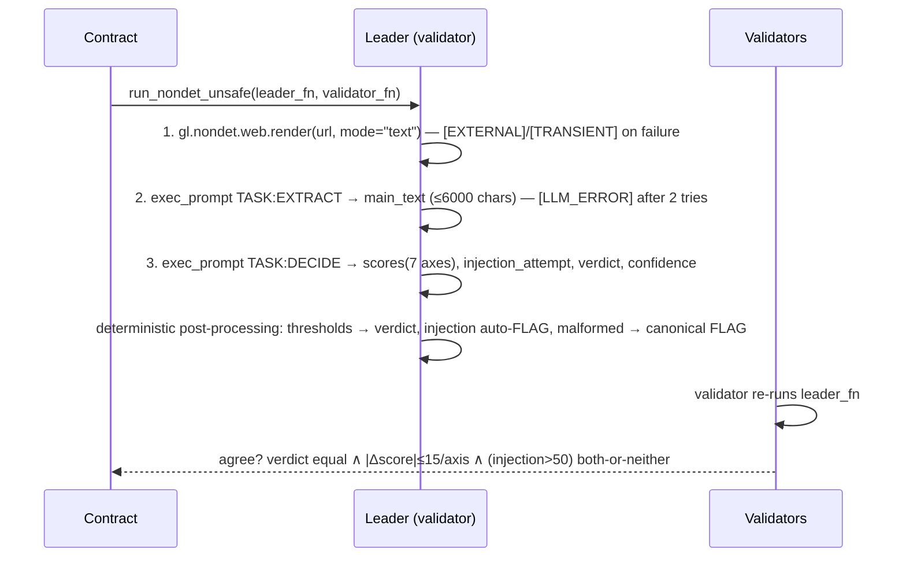

# Architecture — ContentModerator Registry v2

Monorepo: `contracts/registry_v2.py` (Intelligent Contract), `packages/sdk`
(TS client), `apps/api` (Moderation-as-a-Service), `apps/web` (Next.js dApp),
`tests/direct` (77 in-memory GenVM tests). v1 lineage (`moderator.py`,
`registry.py`, legacy dApp) is retained for history.

## State machine

```mermaid
stateDiagram-v2
    [*] --> created: create_item()
    created --> ingested: ingest() + author stake (URL validation, dedup)
    ingested --> moderated: moderate() — EP consensus (fetch → extract → decide)
    moderated --> moderated: re-run [owner or active report; LLM cooldown]
    moderated --> enforced: enforce() [owner, or anyone after timeout] + settle
    enforced --> appealed: appeal() [author] + bond
    appealed --> resolved: resolve_appeal() — permissionless consensus, overturned
    appealed --> enforced: resolve_appeal() — upheld / reclaim_appeal() [after timeout]
    enforced --> [*]
    resolved --> [*]
```



`enforce()`, `resolve_appeal()` and `reclaim_appeal()` all have permissionless
timeouts: no actor can freeze staked value. Time is
`datetime.now(timezone.utc)` — bound by GenLayer to the transaction timestamp
(deterministic per docs); tests advance it with `vm.warp()`.

## Typed storage

```text
Item (@allow_storage)      id, source, url_hash, creator/author/reporter,
                           rules_version, content(+hash), status, verdict,
                           per-axis u8 scores, injection_attempt u8, flags,
                           stakes u256, timestamps u64, history DynArray<HistoryEntry>
TreeMap[str, Item]         items
TreeMap[str, u8]           report_load / appeal_load (per-address caps)
TreeMap[str, str]          url_index (sha256(url) → item)
TreeMap[str, Reputation]   reputation
TreeMap[str, DynArray[str]] author / reporter / status indexes
DynArray[RuleSet]          rules_versions (text + per-axis bps snapshot)
DynArray[Payout]           payouts ledger
```

JSON is emitted only inside views; all logic reads/writes native structures.
Non-deterministic blocks never touch storage: `moderation_pass` copies the url,
rules text and per-axis bps thresholds into plain values before the nondet
block (docs: Storage > non-determinism).

## Equivalence Principle round



If the leader errored, the validator agrees only on the identical classified
`UserError` (`_handle_leader_error`, docs pattern) — so failures propagate as
reverts instead of becoming empty content. The leader's extracted content
becomes the on-chain record (`content`, `content_hash`) once the decision is
agreed; extracted text itself is intentionally not part of the agreement.

## Verdicts from thresholds

Each axis has owner-set `flag_bp` / `remove_bp` (≤10000, snapshotted per rules
version). A top-axis score s maps to REMOVE when `s·100 ≥ remove_bp`, FLAG when
`s·100 ≥ flag_bp`, else APPROVE. `injection_attempt > 50` (or canary-less
detection) forces APPROVE up to FLAG. `confidence < 40` marks `needs_review`.

## Economy

| Actor | On APPROVE | On FLAG | On REMOVE |
|---|---|---|---|
| Author | full refund | half forfeit (`author_partial_forfeit`) | full forfeit |
| Reporter | bond paid to author (`false_report_comp`) | bond + forfeit/2 from pool | bond + forfeit/2 from pool |
| Appellant | overturned: bond + exact `forfeited` restored from pool | (lighter verdict = overturned) | upheld: bond forfeited to pool |

Reputation: `approved/removed` per author, `honest_reports/false_reports` per
reporter, `appeals_won`. Report bond = 80% of base when ≥3 settled reports and
≥70% honesty (`get_required_report_bond`).

## dApp & API boundary

All consensus-critical logic lives in the contract. `apps/web` reads state via
the SDK over public RPC (SWR polling) and signs writes through an EIP-1193
wallet (retries only before broadcast). `apps/api` exposes read endpoints plus
`POST /api/moderate`, which is read-only unless the operator configures a
service key. `public/embed.js` and `/api/badge/{id}.svg` let third parties show
verdicts.
