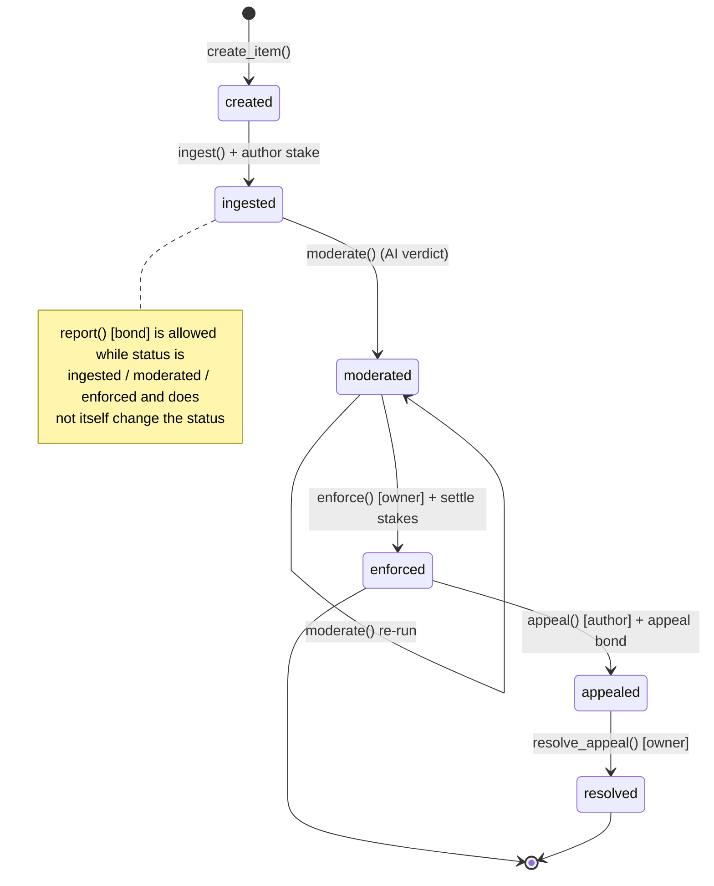
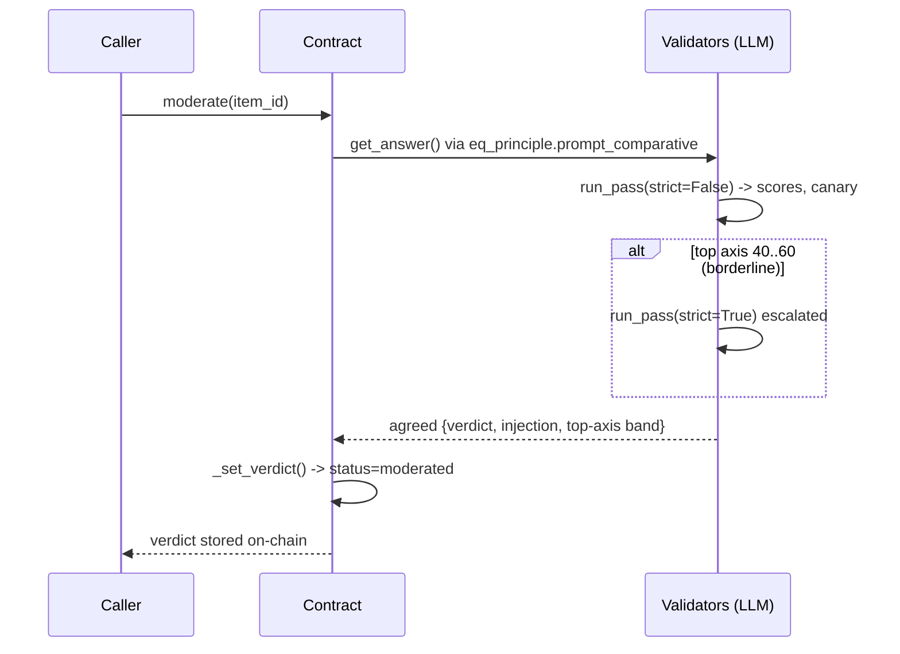

# Architecture — ContentModerator Registry (v1.1)

An on-chain, multi-item content-moderation registry where every
consensus-critical decision (content extraction, policy verdict, source
re-verification) is made inside the Intelligent Contract via the GenLayer
Equivalence Principle. Source: `contracts/registry.py`, deployed on Bradbury at
`0x20f6e32560427094aC913Da6e900c0b4899AE41A`.

## Item lifecycle (state machine)

## State transitions

| From | Function | Guard | To |
|---|---|---|---|
| - | create_item(rules) | any sender | created |
| created | ingest(id,url) payable | status==created, value>=MIN_STAKE, content non-empty | ingested |
| ingested/moderated/enforced | report(id) payable | sender!=author, not already reported, open reports<3, value>=REPORT_BOND | (unchanged) |
| ingested/moderated | moderate(id) | content non-empty | moderated |
| moderated | enforce(id) | owner only | enforced (+ stake settlement) |
| enforced | appeal(id,note) payable | author only, verdict in {REMOVE,FLAG}, not overturned, appeal caps, value>=APPEAL_BOND | appealed |
| appealed | resolve_appeal(id) | owner only | resolved |

## Verdict engine (`_compute_verdict`)

Non-deterministic reasoning collapsed to a deterministic on-chain result:

1. **Extraction** (`_fetch_content`): `gl.nondet.web.render` + LLM extraction of the primary user content, agreed via comparative Equivalence Principle.
2. **Scoring** (`run_pass`): 7 policy axes (scam, spam, harassment, hate, violence, sexual, self_harm) scored 0-100, plus `injection_attempt` and a `GLM-OK` canary.
3. **Escalation**: if top axis is borderline (ESCALATE_LO 40 <= top <= ESCALATE_HI 60), a second, stricter pass runs.
4. **Verdict mapping**:
   - top >= 80  -> REMOVE  (severity high)
   - 50 <= top < 80 -> FLAG (severity medium)
   - top < 50  -> APPROVE
   - injection detected + APPROVE -> forced FLAG
   - confidence = min(100, abs(top - 50) * 2); needs_review if confidence < 40
5. **Consensus**: `gl.eq_principle.prompt_comparative` — validators must agree on the discrete verdict + injection flag + top-axis tolerance band, NOT exact scores, so independent LLM runs converge.

## Stake economics

| Actor | Locks | On REMOVE/FLAG | On APPROVE |
|---|---|---|---|
| Author | MIN_STAKE 1e12 at ingest | forfeited to pool (author_forfeit) | refunded (author_refund) |
| Reporter | REPORT_BOND 1e12 at report | bond returned + bonus = author_stake//2 (reporter_reward) | bond forfeited to author (false_report_comp) |
| Appellant (author) | APPEAL_BOND 2e12 at appeal | if upheld: forfeited to pool (appeal_forfeit) | if overturned: appeal refunded + author_stake restored |

- **Pool**: accumulates forfeited stakes; funds honest-reporter bonuses and restored stakes; toppable by owner via `fund_pool()` (482-486).
- **Payout ledger**: every transfer appended to an on-chain list (`get_payouts`) as `{to, amount, reason}`; transfers use `emit_transfer(value, on='finalized')` (271-277).
- **Content integrity**: `content_hash` (sha256) stored at ingest; `verify_content()` recomputes it, `reverify_source()` re-fetches + LLM-compares live source vs stored content to catch post-moderation swaps.

## Access control

| Function | Caller |
|---|---|
| create_item, ingest, report | any address (report: not the author) |
| appeal | item author only |
| moderate | any address (verdict is consensus-driven, not caller-driven) |
| enforce, resolve_appeal, fund_pool | contract owner only |
